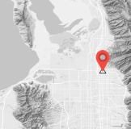
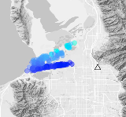
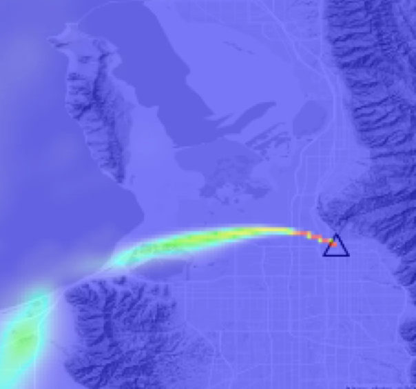
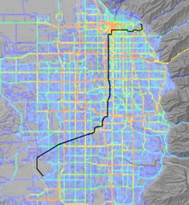

## Stochastic Time-Inverted Lagrangian Transport Model <small>v2.x</small>

---

STILT is an open source lagrangian particle dispersion model which is widely used to simulate the transport of pollution and greenhouse gases through the atmosphere. STILT extends NOAA ARL's popular HYSPLIT model to simplify atmospheric modeling workflows and improve simulation accuracy. Compared to the HYSPLIT model, STILT -

- improves estimates of boundary layer height and vertical mixing
- adds parametrizations to improve simulation accuracy in the hyper near field
- uses a Gaussian weighted influence function to generate a realistic gridded _footprint_
- provides a higher level control layer to orchestrate large batches of simulations
- includes parallelization methods for distributed workloads in HPC and cloud environments
- runs slightly slower per simulation, depending on configuration

While HYSPLIT is a modeling tool capable of running a dispersion simulation, STILT is a framework that includes helpful methods to optimize inputs and manage large sets of simulations at scale.

If your analysis requires a large number of simulations of chemically inert tracers, STILT is likely a good fit. If you need to resolve atmospheric chemistry or maximize single-threaded simulation speed, HYSPLIT or other modeling tools may be better suited.

### What is STILT

<video autoplay loop muted playsinline style="max-width:100%;">
  <source src="static/img/animation-example.webm" type="video/webm">
  <source src="static/img/animation-example.mp4" type="video/mp4">
  Your browser does not support this animation.
</video>

  

    <h3>Particles</h3>
    

      STILT uses meteorological data to transport an ensemble of <b>air parcels</b> backward in time, tracking each particle's sensitivity to surface fluxes
    

  

  

    <h3>Footprint</h3>
    

      These particles are used to calculate a <b>footprint</b> defining the upstream area that influences the air arriving at a given location
    

  

## How STILT works

  

    <h4>1. Define a receptor</h4>
    

      A receptor is defined as a location at a specific time that we are interested in. Often receptors are the location/time that a measurement is made, allowing us to investigate what happened to the air before it arrived at the measurement location.
    

  

  

  

    <h4>2. Release and follow particles</h4>
    

      A cloud of theoretical particles are released from the receptor and followed as they travel backward in time. The average trajectory of the particle cloud is calculated using meteorological wind fields and random velocities are introduced for each particle using a Markov chain process to approximate turbulent motions.
    

  

  

  

    <h4>3. Calculate influence footprints</h4>
    

      The surface influence footprint is calculated using the positions and height above ground of the particles at each time step. Footprints define the area upstream from the receptor as well as the strength of the influence from any given location within the model domain. These footprints can be easily convolved with surface flux inventories to model the contribution of near-field surface fluxes on the receptor.
    

  

  

  

    <h4>4. Evaluate emissions</h4>
    

      Using STILT to relate measurements to emissions estimates is a powerful method for mapping pollution, fine-tuning emissions inventories, and tracking changes in emissions over time.
    

  

  

---

## Version 2 changes

This distribution contains a completely redesigned R codebase and proposes a centralized, collaborative platform for documentation and future model development.

If you're interested in detailed differences between versions or to learn more about the factors that necessitated the development of this modeling framework, see [Simulating atmospheric tracer concentrations for spatially distributed receptors: updates to the Stochastic Time-Inverted Lagrangian Transport model's R interface (STILT-R version 2)](https://doi.org/10.5194/gmd-11-2813-2018).

1. Kernel density based gridding algorithm

   > Influence of particles is spatially distributed using smooth gaussian kernels. This method agrees more closely with realistic idealized brute-force cases over prior dynamic grid coarsening techniques.

2. Hyper-local dilution depth correction

   > Nested gaussian plume model rescales the effective dilution depth for fluxes in the hyper near field. This increases the influence of fluxes originating close to the receptor.

3. Multiple simulations in parallel

   > High level methods for single and multi-node parallelism to run your workload at scale, enabling total simulation time to decrease linearly with the number of parallel processes. A single-shot CLI enables programatic simulations in multiple environments.

4. End-to-end modeling framework
   > Simple controls for transport settings, distributed workloads, and footprint calculations enable a systematic, well-documented workflow for atmospheric dispersion modeling.

---

## Next steps

Dive straight into the model documentation or start with a tutorial.

- [Quick start](quick-start.md)
- [Tutorial: Stationary simulations](https://github.com/uataq/stilt-tutorials/tree/main/01-wbb)
