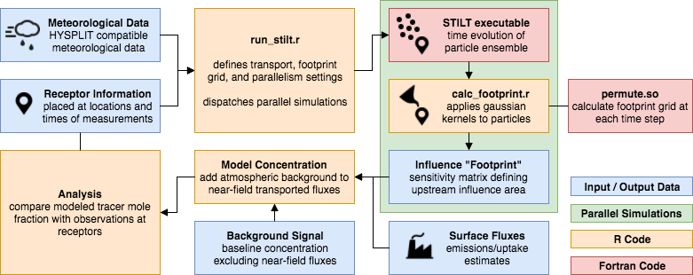
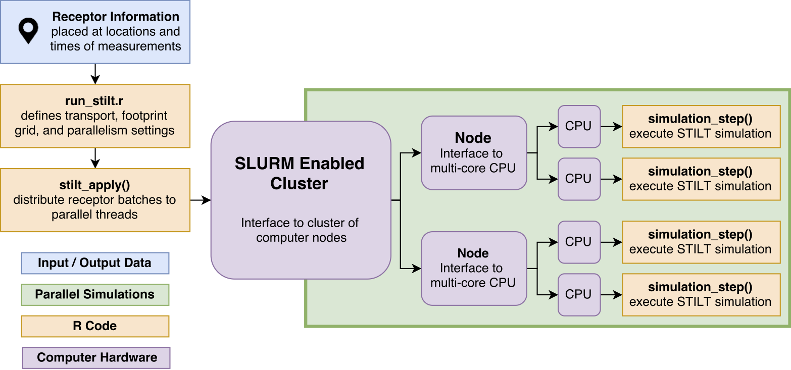

## Running STILT



Now that you have set up a STILT project and configured the simulation settings, it's time to run the model. The model is run by executing the `run_stilt.r` script -

```bash
Rscript r/run_stilt.r
```

User parameters are passed to `stilt_apply(...)`, which dispatches simulations to worker processes. If using SLURM for job submission, STILT will use the `rslurm` package to submit jobs to the scheduler. If running in parallel on a single node without SLURM, `stilt_apply` will use the `parallel` package to run simulations on the current node using `n_cores`. Otherwise, `stilt_apply` will run the simulations serially using `lapply()`.

Depending on which of the three parallelization settings you configured, you will see one of the following.

### Serialized simulations

If `slurm = FALSE` and `n_cores = 1`, STILT will run each simulation sequentially and print the current simulation ID to stdout.

```bash
Rscript r/run_stilt.r
# Initializing STILT
# Number of receptors: 4
# Number of parallel threads: 1
# Parallelization disabled. Executing simulations sequentially...
#
# Running simulation ID: 2015061822_-111.980323_40.782561_5
# ...
```

### Single node parallel

If `slurm = FALSE` and `n_cores > 1`, STILT will fork `n_cores` worker processes and execute the simulations in parallel.


```bash
Rscript r/run_stilt.r

# Initializing STILT
# Number of receptors: 4
# Number of parallel threads: 2
# Single node parallelization. Dispatching worker processes...
#
# Running simulation ID: 2015061822_-111.980323_40.782561_5
# Running simulation ID: 2015061823_-111.980323_40.782561_5
# ...
```

### SLURM distributed workloads



If `slurm = TRUE` STILT will distribute the simulations across `n_nodes` using `n_cores` on each node (total parallel worker count is `n_nodes * n_cores`). This will create a `<stilt_wd>/_rslurm` directory which contains SLURM submission scripts and logs from each node.

```bash
Rscript r/run_stilt.r
# Initializing STILT
# Number of receptors: 4
# Number of parallel threads: 4
# Multi node parallelization using slurm. Dispatching jobs...
# ...
```

> SLURM jobs can be monitored and controlled using `squeue` and `sacct` as well as [other utilities](https://www.chpc.utah.edu/documentation/software/slurm.php) and GUI tools.

### Kubernetes distributed workloads

Get in touch to discuss cloud native options for managing large distributed workloads, error handling with fault tolerance for low cost preemptible node pools, cluster and worker autoscaling, logging, and storage.

---

## Next steps

- [Output files](output-files.md) for details about the particle trajectory and footprint files output by STILT
- [Tutorial: Stationary simulations](https://github.com/uataq/stilt-tutorials/tree/master/01-wbb)
